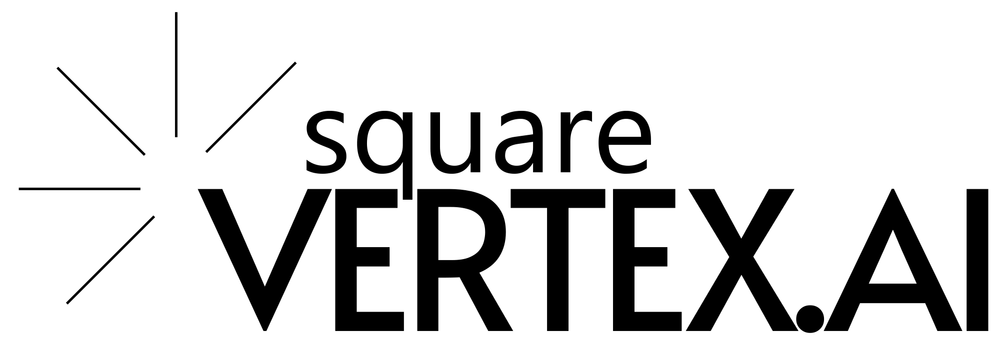

## Welcome
Welcome to **OWASP Tirana** — the first OWASP chapter in Albania and the Western Balkans.

We started this chapter because we believe security is **intrinsic** to well-designed software.  
The chapter was founded by
<a href="https://www.linkedin.com/in/kreshnikrexha" target="_blank" rel="noopener">Kreshnik Rexha</a> &
<a href="https://www.linkedin.com/in/mariokazazi" target="_blank" rel="noopener">Mario Kazazi</a>.

OWASP Tirana brings Albania a vendor-neutral, community-led hub for building safer software. We run meetups, trainings, and projects that upskill local engineers and students, share open standards like ASVS and SAMM, and connect startups, universities, and the public sector with a global security network. Our goal is practical: reduce real-world risk, support compliance with EU regulations, and help Albanian teams ship secure, trustworthy digital services.

---------------------

## Chapter Supporters
----------------

The organizations below support our local activities (e.g., venues, community collaboration). OWASP remains vendor-neutral.

<!-- White background, centered logos, no zebra striping -->

  <table role="presentation" cellpadding="12" cellspacing="0" style="width:100%;background:#fff;border-collapse:separate;border-spacing:0;">
    <tr style="background:#fff;">
      <td style="background:#fff;border:none;vertical-align:middle;text-align:center;padding:12px 18px;">
        
      </td>
      <td style="background:#fff;border:none;vertical-align:middle;text-align:center;padding:12px 18px;">
        
      </td>
      <td style="background:#fff;border:none;vertical-align:middle;text-align:center;padding:12px 18px;">
        
      </td>
    </tr>
  </table>

---------------------

## Next Meeting/Event
---------------------


  <a href="https://www.meetup.com/owasp-tirane-chapter/events/310936465/?eventOrigin=group_events_list" target="_blank" rel="noopener">   
    View all upcoming events on our Meetup page →
  </a>

## Participation
The Open Worldwide Application Security Project (OWASP) is a nonprofit foundation that works to improve the security of software.  
All of our projects, tools, documents, forums, and chapters are free and open to anyone interested in improving application security.

Chapters are led by local leaders in accordance with the <a href="/www-policy/operational/chapters">Chapters Policy</a>.  
We encourage you to participate in our <a href="/projects/">Projects</a>, <a href="/chapters/">Local Chapters</a>, <a href="/events/">Events</a>,
<a href="https://groups.google.com/a/owasp.com/" target="_blank" rel="noopener">Online Groups</a>,
and <a href="https://owasp.slack.com/" target="_blank" rel="noopener">Community Slack Channel</a>.

## Stay Connected
- Meetup: <a href="https://www.meetup.com/owasp-tirane-chapter/events/" target="_blank" rel="noopener">Join upcoming events</a>  
- LinkedIn: <a href="https://www.linkedin.com/in/kreshnikrexha" target="_blank" rel="noopener">Kreshnik Rexha</a> · <a href="https://www.linkedin.com/in/mariokazazi" target="_blank" rel="noopener">Mario Kazazi</a>
- YouTube: <a href="https://www.youtube.com/@OWASPTirana" target="_blank" rel="noopener">Subscribe</a>  
- Global OWASP Slack: <a href="https://owasp.slack.com/" target="_blank" rel="noopener">owasp.slack.com</a>
